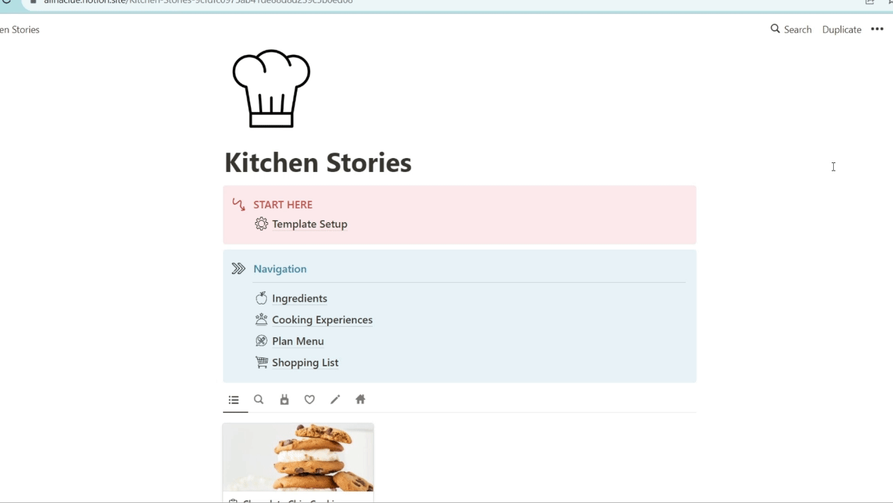

Text can be **bold**, _italic_, or ~~strikethrough~~.

There should be whitespace between paragraphs.

There should be whitespace between paragraphs. We recommend including a README, or a file with information about your project.

# Project 1

Photo
[See more](./project1.md). 

Objectives:
* first
* second

Insights:

## Project 2

> This is a blockquote following a header.
>
> When something is important enough, you do it even if the odds are not in your favor.
>
> img-test
> 
